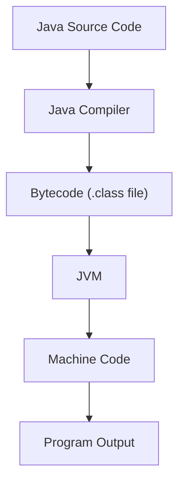
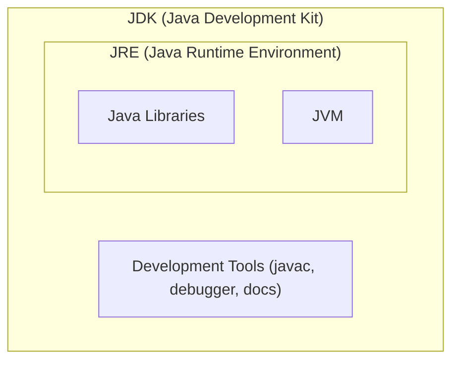
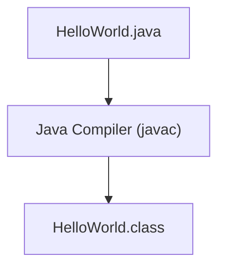
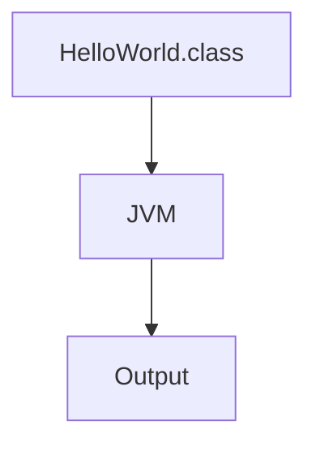
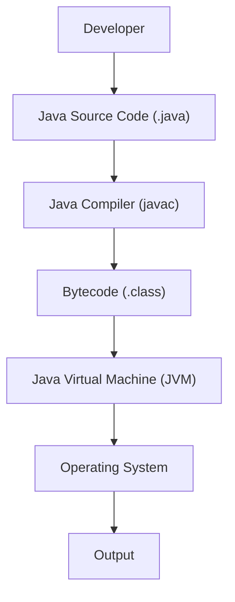

# ☕ Introduction to Java

## 📑 Table of Contents

- [What is Java?](#what-is-java)
- [Features of Java](#features-of-java)
- [JVM (Java Virtual Machine)](#jvm-java-virtual-machine)
- [JRE (Java Runtime Environment)](#jre-java-runtime-environment)
- [JDK (Java Development Kit)](#jdk-java-development-kit)
- [Difference Between JVM, JRE and JDK](#difference-between-jvm-jre-and-jdk)
- [First Java Program](#first-java-program)
- [Java Compilation Process](#java-compilation-process)
- [Complete Java Execution Flow](#complete-java-execution-flow)
- [বিরিয়ানি এনালজি (Biriyani Analogy)](#-বিরিয়ানি-এনালজি-biriyani-analogy)

---

## What is Java?

Java is a **high-level, object-oriented, class-based** programming language developed by **James Gosling** and **Sun Microsystems** in **1995**.

### Java is widely used for developing

- Web applications
- Desktop applications
- Mobile applications
- Enterprise software
- Backend systems
- Cloud-based applications

### Platform Independence

One of the most important features of Java is **platform independence**.

> **Write Once, Run Anywhere (WORA)**

It means a Java program can run on any operating system that has a **Java Virtual Machine (JVM)**.

---

## Features of Java

### 1. Object-Oriented

Java is based on **Object-Oriented Programming (OOP)**.

Main concepts of OOP:

- Class
- Object
- Inheritance
- Polymorphism
- Encapsulation
- Abstraction

### 2. Platform Independent

- Java source code is converted into **bytecode**.
- This bytecode can run on different operating systems through the **JVM**.

**Example:** A Java program created on Windows can run on Linux or Mac using JVM.

### 3. Simple

Java syntax is easy to understand compared to many other programming languages.

### 4. Secure

Java provides security features such as:

- No direct memory access
- Bytecode verification
- Runtime security checking

### 5. Robust

Java provides:

- Automatic memory management
- Exception handling
- Strong type checking

---

## JVM (Java Virtual Machine)

### Definition

**JVM** stands for **Java Virtual Machine**.

It is a virtual machine that runs Java bytecode and converts it into machine-level instructions. JVM is responsible for executing Java programs.

### Working Process



### Responsibilities of JVM

- Loads Java bytecode
- Verifies bytecode
- Executes bytecode
- Manages memory
- Provides security

---

## JRE (Java Runtime Environment)

### Definition

**JRE** stands for **Java Runtime Environment**.

JRE provides the environment required to **run** Java applications.

### It contains

```
JRE = JVM + Java Libraries
```

JRE is mainly used by users who only need to run Java applications.

---

## JDK (Java Development Kit)

### Definition

**JDK** stands for **Java Development Kit**.

JDK is a complete package used by developers to **create, compile, debug, and run** Java programs.

### It contains

```
JDK = JRE + Development Tools
```

### Development tools include

- Java Compiler (`javac`)
- Debugger
- Documentation tools

---

## Difference Between JVM, JRE and JDK

| Component | Purpose                    | Contains                  |
| --------- | -------------------------- | ------------------------- |
| **JVM**   | Runs Java bytecode         | Execution Environment     |
| **JRE**   | Runs Java applications     | JVM + Libraries           |
| **JDK**   | Develops Java applications | JRE + Development Tools   |



---

## First Java Program

### Example

```java
public class HelloWorld {

    public static void main(String[] args) {

        System.out.println("Hello Java");

    }

}
```

### Explanation of First Program

#### Class

```java
public class HelloWorld
```

A **class** is a blueprint that contains variables and methods. Every Java program must have at least one class.

#### Main Method

```java
public static void main(String[] args)
```

The `main` method is the **entry point** of a Java program. JVM starts program execution from the `main` method.

#### Print Statement

```java
System.out.println("Hello Java");
```

This statement prints output on the console.

### Output

```
Hello Java
```

---

## Java Compilation Process

Java follows a **multi-step execution process**.

### Step 1: Writing Source Code

Developer writes Java code in a file:

```
HelloWorld.java
```

This file contains human-readable Java code.

### Step 2: Compilation

**Command:**

```bash
javac HelloWorld.java
```

The Java compiler converts source code into bytecode.



The `.class` file contains **Java bytecode**.

### Step 3: Execution

**Command:**

```bash
java HelloWorld
```

JVM executes the bytecode.



---

## Complete Java Execution Flow



---

## 🍛 বিরিয়ানি এনালজি (Biriyani Analogy)

মনে করুন, আপনি একটি আন্তর্জাতিক রেস্তোরাঁ চেইন চালাতে চান, যেখানে সারা বিশ্বের শেফদের দিয়ে একই স্বাদের বিরিয়ানি রান্না করাবেন। এই পুরো রান্নাঘরের ব্যবস্থাটাই হলো জাভার কাজের ফ্লো!

### ১. সিক্রেট রেসিপি লেখা (`.java` Source Code)

প্রথমে আপনি আপনার নিজস্ব ভাষায় (ধরা যাক বাংলায়) বিরিয়ানির একটা মূল রেসিপি লিখে তৈরি করলেন। এটি হলো আপনার **সোর্স কোড** — `Biriyani.java`।

> ⚠️ **সমস্যা:** এই খাতা সরাসরি টোকিও, লন্ডন বা ঢাকার স্থানীয় বাবুর্চিদের দিলে তারা আপনার হাতের লেখা বা বাংলা ভাষা বুঝবে না।

### ২. হেড শেফের এনকোডিং (`javac` - JDK-র অংশ)

এবার আপনার পাশে আছেন আপনার প্রধান সহকারী বা হেড শেফ **`javac`**। তিনি আপনার লেখা রেসিপিটা পড়ে আন্তর্জাতিক মানের বিশেষ সাংকেতিক কোডে (Universal Cooking Steps) লিখে একটি কার্ডে রূপান্তর করলেন।

এই নতুন কার্ডটি হলো **বাইটকোড** (`Biriyani.class`)। এখন এই কার্ডটি যেকোনো দেশের রেস্তোরাঁয় পাঠানো যাবে — এটা তৈরি করাতেই **JDK-র মূল কাজ শেষ!**

### ৩. রান্নাঘরের পরিবেশ ও মসলার বাক্স (JRE)

আপনি কার্ডটি লন্ডনের এক রেস্তোরাঁয় পাঠিয়ে দিলেন। রান্নার জন্য কেবল কার্ড থাকলেই তো হবে না, চুলা, তেল, লবণ আর মসলাপাতিও লাগবে!

এই রান্নাঘরের পুরো সেটআপ আর সেলফে সাজিয়ে রাখা আগে থেকে তৈরি বিভিন্ন মসলার জার (**Built-in Libraries**) হলো **JRE**। এটি কার্ড অনুযায়ী রান্না শুরু করার পারফেক্ট পরিবেশ তৈরি করে দেয়।

### ৪. স্থানীয় শেফ এবং ডেলিভারি (JVM)

রান্নাঘরের ভেতর দাঁড়িয়ে আছেন লন্ডনের স্থানীয় এক শেফ — যিনি হলেন **JVM**।

1. তিনি সেই সার্বজনীন সাংকেতিক কার্ড (`.class`) হাতে নিলেন।
2. তাক থেকে লবণ-মসলা (Java Libraries) নিলেন।
3. কার্ডের প্রতিটি নির্দেশ এক এক করে পড়ে সাথে সাথে তা তাওয়া আর আগুনে প্রয়োগ করলেন (মেশিন কোডে রূপান্তর করলেন)।

✅ **ফলাফল:** গরম গরম ধোঁয়া ওঠা পারফেক্ট বিরিয়ানি রেডি — অর্থাৎ আপনার প্রোগ্রাম সফলভাবে রান হলো!

### ✨ ম্যাজিকটা কোথায়?

একই রেসিপি কার্ড (`.class`) যদি জাপানের রেস্তোরাঁয় পাঠান, সেখানে থাকা জাপানি শেফ (Mac-এর JVM) তার মতো করে চুলা জ্বালাবে; আবার ঢাকায় পাঠালে বাংলাদেশি শেফ (Windows-এর JVM) তার মতো করে তাওয়া সামলাবে।

রেসিপি কাউকে নতুন করে লিখতে হলো না — **"Write Once, Run Anywhere"!**

### 📊 এনালজি ম্যাপিং টেবিল

| রান্নাঘরের অংশ                  | Java-র অংশ              |
| ------------------------------- | ----------------------- |
| মূল রেসিপি (বাংলায়)            | Source Code (`.java`)   |
| হেড শেফ                         | `javac` (Compiler, JDK) |
| সার্বজনীন সাংকেতিক কার্ড        | Bytecode (`.class`)     |
| রান্নাঘর + মসলার জার            | JRE (Libraries)         |
| স্থানীয় শেফ                    | JVM                     |
| গরম বিরিয়ানি                   | Program Output          |
