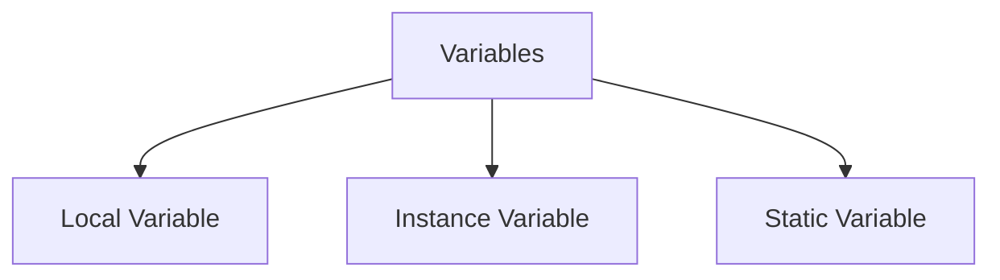
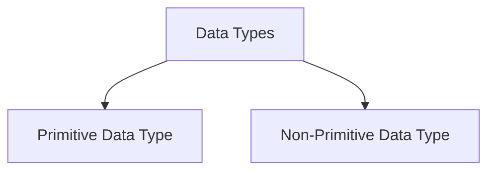
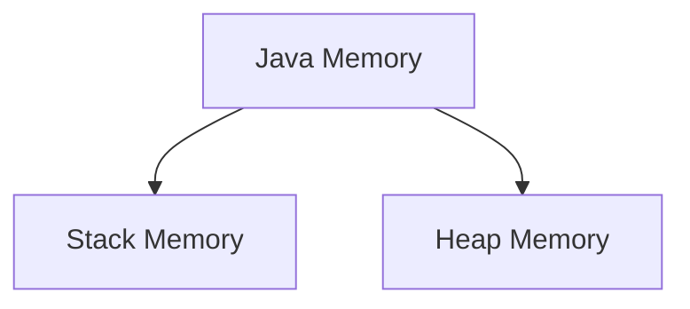
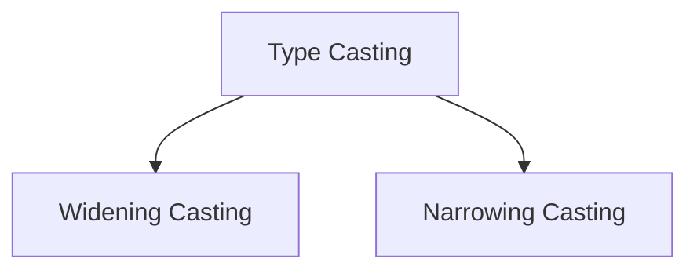
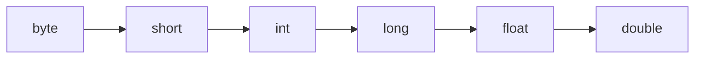
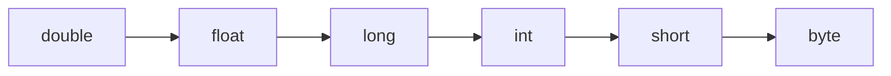

# 📦 Variables, Data Types, Memory Allocation, Input & Type Casting

> 📁 **Note File:** `01-Java-Basics/notes/variables-data-types.md`

## 📑 Table of Contents

1. [Variables in Java](#1-variables-in-java)
2. [Rules for Naming Variables](#2-rules-for-naming-variables)
3. [Types of Variables in Java](#3-types-of-variables-in-java)
4. [Data Types in Java](#4-data-types-in-java)
5. [Non-Primitive Data Types](#5-non-primitive-data-types)
6. [Memory Allocation in Java](#6-memory-allocation-in-java)
7. [Taking Input in Java](#7-taking-input-in-java)
8. [Type Casting in Java](#8-type-casting-in-java)
9. [Important Interview Questions](#-important-interview-questions)
10. [Practice Tasks](#-practice-tasks)

---

## 1. Variables in Java

### What is a Variable?

A **variable** is a container used to store data values in computer memory.

In Java, every variable has:

1. A **data type**
2. A **variable name**
3. A **value**

### Syntax

```java
dataType variableName = value;
```

### Example

```java
int age = 25;
```

Here:

| Part  | Meaning       |
| ----- | ------------- |
| `int` | Data Type     |
| `age` | Variable Name |
| `25`  | Value         |

### Why do we need Variables?

Variables allow programs to **store and manipulate data**.

```java
int price = 500;

System.out.println(price);
```

**Output:**

```
500
```

Instead of writing `500` everywhere, we can use the variable `price`.

---

## 2. Rules for Naming Variables

Java variable names must follow some rules.

| ✅ Valid Examples | ❌ Invalid Examples |
| ----------------- | ------------------- |
| `age`             | `1number`           |
| `studentName`     | `student-name`      |
| `totalPrice`      | `class`             |
| `number1`         |                     |

### Naming Convention

Java follows the **camelCase** convention.

```
firstName
accountBalance
totalMarks
```

---

## 3. Types of Variables in Java

Java has **three** types of variables:



### 1. Local Variable

A variable declared **inside a method** is called a local variable.

```java
public class Example {

    public static void main(String[] args) {

        int age = 20;

        System.out.println(age);

    }

}
```

`age` is a local variable.

### 2. Instance Variable

A variable declared **inside a class but outside any method** is called an instance variable.

```java
class Student {

    String name;
    int age;

}
```

`name` and `age` are instance variables.

### 3. Static Variable

A variable declared with the **`static`** keyword is called a static variable.

```java
class Student {

    static String school = "ABC School";

}
```

Static variables belong to the **class**.

### 📊 Comparison: Local vs Instance vs Static

| Feature                | Local Variable                                                      | Instance Variable                                                    | Static (Class) Variable                                                      |
| ---------------------- | ------------------------------------------------------------------- | -------------------------------------------------------------------- | ---------------------------------------------------------------------------- |
| **Declaration**        | Inside a method, constructor, or block                              | Inside a class, but outside any method/block                         | Inside a class, outside methods, declared with `static`                      |
| **Scope / Visibility** | Only accessible within the method/block where declared              | Accessible throughout all non-static methods of the class            | Accessible globally within the class (and outside via class name)           |
| **Memory Location**    | Stack memory                                                        | Heap memory (inside object)                                          | Non-Heap / Metaspace (Method Area)                                           |
| **Lifetime**           | Created on method call; destroyed when method completes            | Created when an object is instantiated (`new`); destroyed when garbage-collected | Created when the class is loaded by the ClassLoader; destroyed when the class is unloaded |
| **Default Value**      | No default value. Must be initialized before use, or compiler throws error | Gets default value (e.g., `0`, `false`, `null`) if not explicitly initialized | Gets default value (e.g., `0`, `false`, `null`) if not explicitly initialized |
| **Access Modifiers**   | Cannot use access modifiers (`public`, `private`, `protected`)      | Can use access modifiers (`public`, `private`, `protected`, default) | Can use access modifiers (`public`, `private`, `protected`, default)         |
| **Copies**             | Created fresh on every method invocation                            | Each object instance has its own separate copy                       | Only one single copy is shared across all instances of the class             |
| **Access Syntax**      | Directly by name inside the block: `variableName`                   | Via object reference: `obj.variableName`                             | Via class name: `ClassName.variableName`                                     |

---

## 4. Data Types in Java

### What is a Data Type?

A data type defines:

- What **type of data** a variable can store
- **How much memory** it requires

```java
int age = 25;
```

Here `int` tells Java that `age` will store an integer value.

### Categories of Data Types



### 1. Primitive Data Types

Primitive data types are **built-in** data types provided by Java.

Java has **8 primitive data types**:

| Data Type | Size    | Example      |
| --------- | ------- | ------------ |
| `byte`    | 1 byte  | `100`        |
| `short`   | 2 bytes | `5000`       |
| `int`     | 4 bytes | `100000`     |
| `long`    | 8 bytes | `999999L`    |
| `float`   | 4 bytes | `10.5f`      |
| `double`  | 8 bytes | `99.99`      |
| `char`    | 2 bytes | `'A'`        |
| `boolean` | 1 bit   | `true/false` |

#### Integer Types

**`byte`** — stores small integer values.

```java
byte age = 20;
```

Range: `-128` to `127`

**`short`**

```java
short salary = 30000;
```

**`int`** — most commonly used integer type.

```java
int population = 1000000;
```

**`long`** — used for very large numbers.

```java
long phoneNumber = 8801712345678L;
```

#### Decimal Types

**`float`** — stores decimal numbers.

```java
float price = 99.5f;
```

> ⚠️ Need `f` at the end.

**`double`** — more precision than `float`.

```java
double pi = 3.141592;
```

#### Character Type

**`char`** — stores a **single** character.

```java
char grade = 'A';
```

#### Boolean Type

Stores `true` or `false`.

```java
boolean isJavaEasy = true;
```

---

## 5. Non-Primitive Data Types

Non-primitive data types are **created by programmers**.

Examples:

- `String`
- `Array`
- `Class`
- `Interface`
- `Object`

```java
String name = "Rahim";
```

### Primitive vs Non-Primitive

| Primitive              | Non-Primitive           |
| ---------------------- | ----------------------- |
| Built-in               | Created by programmer   |
| Stores actual value    | Stores reference        |
| Fixed size             | Flexible size           |
| `int`, `char`, `boolean` | `String`, `Array`, `Class` |

---

## 6. Memory Allocation in Java

Java memory is divided into different areas.



### Stack Memory

Stack stores:

- Local variables
- Method calls
- Primitive values

```java
public static void main(String[] args) {

    int age = 20;

}
```

**Memory:**

```
Stack

age → 20
```

### Heap Memory

Heap stores:

- Objects
- Instance variables

```java
Student s = new Student();
```

**Memory:**

```
Stack                Heap

  s  ───────────►   Student Object
```

### Memory Diagram

```
                    JVM Memory

        ┌────────────────────────────┐
        │        Stack Memory        │
        │                            │
        │   age = 20                 │
        │   name reference ──────┐   │
        └────────────────────────│───┘
                                 │
        ┌────────────────────────▼───┐
        │        Heap Memory         │
        │                            │
        │   Student Object           │
        │   String Object            │
        └────────────────────────────┘
```

### 🔍 Detailed Explanation (বিস্তারিত)

#### ১. Stack Memory (Temporary & Fast)

- **Kano bebohar hoy:** Ekhane method execution ebong local variable songrokkhon kora hoy।
- **Data Structure:** LIFO (Last-In-First-Out) poddhoti onushon kore kaj kore।
- **Ki thake:**
  - Primitive data types (jemone: `int`, `boolean`, `char`) er local man।
  - Heap-e thaka object-er reference (thikana ba memory address)।
- **Lifecycle:** Jokhon kono method call kora hoy, Stack-e ekta **frame** toiri hoy; method execution sesh hole frame-sho shob local variable sathe sathe delete hoye jay।
- **Memory Error:** Stack er shima charale `StackOverflowError` ghote (jemone: infinite recursion-e hoy)।

#### ২. Heap Memory (Dynamic & Shared)

- **Kano bebohar hoy:** Java-r shob object ebong array Heap memory-te allocate kora hoy (`new` keyword diye)।
- **Ki thake:**
  - Asol object-gulo ebong tader vetor thaka instance variables।
  - Thread-gulo eke oporer moddhe ei memory share korte pare।
- **Lifecycle:** Method sesh holei Heap-er object delete hoy na; jotokkhon porjonto kono reference thake totokkhon theke jay। Kono reference na thakle **Garbage Collector (GC)** pore eshe sheti delete kore।
- **Memory Error:** Heap full hoye gele `OutOfMemoryError: Java heap space` dekhay।

#### ৩. Metaspace / Method Area (Permanent & Class Info)

- **Kano bebohar hoy:** Class-er structure ebong meta-information dhorer jonno।
- **Ki thake:** Class metadata, Bytecode, **Static variables** ebong Constant Pool।
- **Lifecycle:** Class loader jokhon class load kore tokhon ekhane jayga ney, application bondho ba class unload na howa porjonto theke jay।

### 💻 Ekta Code Diye Bujhar Upay

```java
public class MemoryDemo {
    public void createStudent() {
        int age = 22;                       // 1. Primitive -> Pure Stack
        Student s = new Student("Rahim");    // 2. Reference 's' -> Stack; Object "Rahim" -> Heap
    }
}
```

- `age = 22`: Shasori **Stack Memory**-te boshe।
- `s`: Ekti reference pointer, ja thake **Stack Memory**-te।
- `new Student("Rahim")`: Asol Student object-ti toiri hoy **Heap Memory**-te। Stack-e thaka `s` variable-ti Heap-er ei object-ke point kore rakhe।

`createStudent()` method sesh hole `age` ebong `s` Stack theke muche jay, ar Heap-e thaka object-ti *orphaned* hoye jay ja pore **Garbage Collector** delete kore dey।

### 📊 Stack vs Heap vs Metaspace (Quick Summary)

| Feature        | Stack                         | Heap                            | Metaspace / Method Area              |
| -------------- | ----------------------------- | ------------------------------- | ------------------------------------ |
| **Stores**     | Local variables, method calls, references | Objects, instance variables, arrays | Class metadata, bytecode, static variables, constant pool |
| **Nature**     | Temporary & fast (LIFO)       | Dynamic & shared                | Permanent & class info               |
| **Cleanup**    | Auto, when method ends        | Garbage Collector               | When class is unloaded               |
| **Error**      | `StackOverflowError`          | `OutOfMemoryError`              | —                                    |

---

## 7. Taking Input in Java

Java uses the **`Scanner`** class to take input from users.

### Import Scanner

```java
import java.util.Scanner;
```

### Create Scanner object

```java
Scanner input = new Scanner(System.in);
```

### Taking Integer Input

```java
int age = input.nextInt();
```

### Taking String Input

**Single word:**

```java
String name = input.next();
```

**Full sentence:**

```java
String message = input.nextLine();
```

### Complete Example

```java
import java.util.Scanner;

public class UserInput {

    public static void main(String[] args) {

        Scanner input = new Scanner(System.in);

        System.out.print("Enter your name: ");

        String name = input.nextLine();

        System.out.println("Hello " + name);

    }

}
```

**Output:**

```
Enter your name: Rahim
Hello Rahim
```

---

## 8. Type Casting in Java

### What is Type Casting?

Type casting means **converting one data type into another** data type.

There are two types:



### 1. Widening Casting

**Small data type → Large data type**

Automatically done by Java.

```java
int number = 100;

double value = number;
```

**Flow:** `int` → `double`

✅ No data loss.

### 2. Narrowing Casting

**Large data type → Small data type**

Manually done.

```java
double price = 99.99;

int value = (int) price;
```

**Output:**

```
99
```

⚠️ Decimal part removed.

### Type Casting Diagram

**Widening Casting** (automatic)



**Narrowing Casting** (manual)



---

## 🎯 Important Interview Questions

**Q1. What is a variable?**
A variable is a container that stores data values in memory.

**Q2. How many primitive data types are available in Java?**
Java has **8** primitive data types.

**Q3. Difference between Stack and Heap memory?**
Stack stores local variables and method calls, while Heap stores objects and instance data.

**Q4. What is type casting?**
Type casting is converting one data type into another data type.

**Q5. Difference between `float` and `double`?**
`double` provides more precision and stores larger decimal values than `float`.

---

## 📝 Practice Tasks

Create folder structure:

```
01-Java-Basics
└── code
```

Create these files:

### 1. `VariablesPractice.java`

Create variables:

- Name
- Age
- Height
- Salary
- IsStudent

Print all values.

### 2. `UserInformation.java`

Take input:

- Name
- Age
- Country

Display:

```
My name is ___
I am ___ years old
I live in ___
```

### 3. `TypeCasting.java`

Perform:

- `int` → `double`
- `double` → `int`

Print results.
